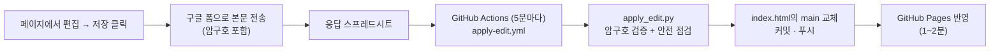

# 빌더스게이트 AX 상품 소개 페이지

**보기: https://bluuhans.github.io/bg-ax-page/**

빌더스게이트의 AX(AI 전환) 상품을 소개하는 원페이지다. "기술이 절감한 시간을 사람에게 돌려준다"는 철학을 서사로 풀고, 상품 구성과 신뢰 원칙을 거쳐 상담 신청으로 이어지는 구조다. 별도 빌드 없이 단일 HTML 파일 하나로 GitHub Pages에서 서빙한다.

기본 화면은 편집 도구가 없는 깨끗한 상태다 — 주소 그대로 외부에 공유하면 된다. 편집할 때만 `/edit/`(또는 `?edit`)로 들어간다.

```
보기(공유용):  https://bluuhans.github.io/bg-ax-page/
편집(내부용):  https://bluuhans.github.io/bg-ax-page/edit/
```

## 페이지 구성 (서사 순서)

1. **히어로** — 풀블리드 사진 위 인용문. "화면이 아니라 서로를 보는" 장면
2. **질문** — 대부분의 AI 도입이 실패하는 이유. 열 가지 진단 질문 중 맛보기 4문
3. **철학** — 환원·해방·질문 3원칙 + "같은 하루, 시간이 머무는 곳이 달라집니다" 사진 3연작
4. **상품** — 2주 진단 → 구축 → 동행 운영 3단 구성
5. **패턴** — 자주 만드는 시스템 유형 4종
6. **인터루드** — 풀블리드 사진 밴드. "기술의 끝에서 다시 사람을 봅니다"
7. **신뢰** — 정직한 성과 곡선(임계점), 수치(누적 20+ / 7년 / 숨은 비용 0원), 계약 원칙
8. **비전** — 다가올 변화까지 내다보는 설계
9. **피날레 CTA** — 풀블리드 배경 위 상담 신청
10. (숨김) FAQ — 마크업은 남아 있고 `hidden` 속성으로만 꺼둔 상태. 되살리려면 속성만 제거

## 기술 개요

- **의존성 0** — 프레임워크·빌드 도구 없음. HTML + CSS + 바닐라 JS 단일 파일
- **서체** — 본문 Pretendard, 강조·인용 Noto Serif KR (CDN 로드)
- **색** — 전부 `oklch()` 토큰으로 관리. 메인 컬러는 딥 앰버 `oklch(0.47 0.09 63)`(≈ #7E4E1D, 본문 대비 6.7:1), 배경은 웜 화이트
- **애니메이션**
  - 스크롤 리빌: IntersectionObserver로 진입·이탈 시마다 재생 (한 번만 나오고 끝나지 않음)
  - 스태거(70ms 간격), 잉크 리빌(clip-path), 히어로 켄번즈
  - CSS scroll-driven animation(`animation-timeline`): 상단 진행 헤어라인, 사진 시차
  - `prefers-reduced-motion` 사용자는 모션 없이 정적 표시
- **접근성·반응형** — 시맨틱 랜드마크, alt 텍스트, 대비 AA 이상, 모바일 최적화

## 편집·저장 파이프라인

페이지 안에서 직접 고치고 저장하면 이 저장소에 자동 커밋된다. 서버 없이 구글 폼을 중계로 쓴다.



**사용 방법**

1. `/edit/`로 접속 → 페이지 우하단 **편집** 클릭 → 본문 텍스트를 직접 수정
2. **저장** 클릭 → 암구호 입력 (최초 1회만 물어보고 브라우저에 기억됨)
3. 5~7분 뒤 자동 반영. **받기** 버튼은 수정본 HTML 다운로드, **원본**은 수정 전으로 복귀

**안전장치** — apply_edit.py는 반영 전에 다음을 검사한다: 암구호 일치(Secrets `EDIT_PASSPHRASE`, 쉼표로 복수 등록 가능), 본문 길이 하한, 섹션 태그 짝, 히어로 구조 존재. 하나라도 어긋나면 그 저장분은 건너뛴다. 시트 주소는 Secrets `SHEET_CSV_URL`로 관리한다.

## 파일 구성

| 파일 | 역할 |
|---|---|
| `index.html` | 페이지 전체 — 마크업·스타일·스크립트 단일 파일 |
| `img/` | 사진 8장 (히어로, 3연작, 상품, 인터루드, 비전, 피날레) |
| `apply_edit.py` | 웹 저장분을 `<main>`에 반영하는 스크립트 (안전 점검 포함) |
| `.github/workflows/apply-edit.yml` | 5분마다 저장 응답 CSV를 확인해 위 스크립트 실행 |
| `.last-sync` | 마지막으로 반영한 저장 시각 (중복 반영 방지) |

## 코드로 직접 수정할 때 (관리자)

구조·스타일 변경은 페이지 편집이 아니라 코드로 한다.

```bash
git clone https://github.com/bluuhans/bg-ax-page.git
cd bg-ax-page
# index.html 수정 후
git pull        # 웹 저장 커밋이 먼저 들어와 있을 수 있다 — 반드시 선행
git add . && git commit -m "..." && git push
```

**동기화 규칙 (중요)**

- 원본(단일 진실 원천)은 사내 Drive의 `Buildersgate/manager_han/BuildersGate_AX/05_상품설계/index.html`이다. 카피 원본은 같은 폴더의 `ux-guide.md`, 디자인 토큰은 `design.md`
- 이 저장소에서 직접 고쳤거나 웹 저장 커밋이 쌓였으면 Drive 원본에도 역반영한다. 양쪽이 갈라지면 다음 배포 때 한쪽 수정이 유실된다

## 저장이 반영되지 않을 때

1. [Actions 탭](https://github.com/bluuhans/bg-ax-page/actions)에서 최근 `apply-edit` 실행 로그 확인
2. "암구호 불일치"면 저장 시 입력한 암구호 확인 (브라우저에 잘못 기억됐으면 페이지 콘솔에서 `localStorage.removeItem('ax-pass')` 후 재저장)
3. "안전 점검 실패"면 편집 중 구조가 크게 깨진 경우 — 관리자에게 알리고 코드로 복구
4. Actions는 5분 주기라 최대 7분까지는 정상 대기

## 사진 출처

모든 사진은 [Unsplash](https://unsplash.com) 라이선스(상업적 사용 가능, 크레딧 불요)를 따르며, 페이지 톤에 맞춰 크롭·그레이딩해 사용했다.
